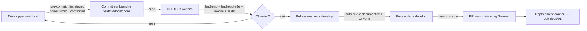

# Protocole d'intégration continue — SoundProof

> **Compétence visée : C2.1.2** — Ce protocole encadre la phase de développement : il est rédigé **avant** l'implémentation des fonctionnalités et s'applique à chaque contribution. Son implémentation technique est le workflow [`.github/workflows/ci.yml`](../.github/workflows/ci.yml).

## 1. Objectif

Fusionner régulièrement les codes sources dans une branche partagée (`develop`) et détecter au plus tôt les régressions : chaque modification poussée est automatiquement vérifiée (lint, typage, tests unitaires, tests e2e, builds, audit de sécurité) avant de pouvoir être intégrée. Un développement ne peut atteindre `develop` ou `main` que si l'intégralité du pipeline est verte.

## 2. Déclencheurs

| Événement                               | Effet                                                                                                                                 |
| --------------------------------------- | ------------------------------------------------------------------------------------------------------------------------------------- |
| `push` sur **toute branche**            | Exécution complète du pipeline CI                                                                                                     |
| `pull_request` vers `develop` ou `main` | Exécution complète du pipeline CI ; la fusion est bloquée tant que la CI n'est pas verte                                              |
| `workflow_call`                         | Le pipeline CI est réutilisable par le workflow de déploiement continu (`cd.yml`), qui l'exécute intégralement avant tout déploiement |

## 3. Séquences d'intégration

Le pipeline est organisé en **jobs parallèles** (backend et mobile sont indépendants) qui suivent chacun l'ordre strict ci-dessous. L'échec d'une étape interrompt le job et fait échouer le pipeline.

### 3.1 Job `backend`

1. **Checkout** du dépôt + installation de **Node.js 20** avec cache npm.
2. **Installation reproductible** : `npm ci` (échoue si le lockfile est désynchronisé — garantie d'intégrité des dépendances).
3. **Lint** : `npm run lint` — 0 erreur, 0 warning tolérés.
4. **Typecheck** : `npm run typecheck` (`tsc --noEmit`).
5. **Tests unitaires avec couverture** : `npm run test:cov` — échec si la couverture est < 80 % (lignes et branches) sur la logique métier (`src/**/*.service.ts`), seuils bloquants dans la configuration Jest.
6. **Build** : `npm run build` (`nest build`).

### 3.2 Job `backend-e2e` (tests d'API de bout en bout)

1. Démarrage d'un **PostgreSQL 16 de service** (services GitHub Actions, BDD éphémère).
2. Checkout + Node 20 + `npm ci`.
3. **Migrations Prisma** : `npx prisma migrate deploy` sur la BDD de service.
4. **Tests e2e** : `npm run test:e2e` (Jest + Supertest) sur les parcours critiques de l'API.

### 3.3 Job `mobile`

1. **Checkout** du dépôt + installation de **Node.js 20** avec cache npm.
2. `npm ci`.
3. **Lint** : `npm run lint` (`eslint-config-expo` + Prettier).
4. **Typecheck** : `npm run typecheck`.
5. **Tests unitaires avec couverture** : `npm run test:cov` (Jest + `jest-expo` + React Native Testing Library), seuils bloquants identiques.
6. **Santé du projet Expo** : `npx expo-doctor` — 0 erreur.
7. **Vérification du bundle** : `npx expo export --platform android` — garantit que le bundle JavaScript compile (équivalent d'un build pour l'app).

### 3.4 Job `audit` (sécurité des dépendances)

1. `npm audit --audit-level=high` sur le backend et le mobile.
2. **Non bloquant** sur les branches de développement (signal d'alerte), **bloquant sur `main`** : aucune vulnérabilité critique ou haute ne peut atteindre une version livrée.

## 4. Règles de fusion

1. Toute intégration dans `develop` ou `main` passe par une **pull request** — aucun push direct sur ces branches.
2. La fusion exige une **CI verte** (tous les jobs ci-dessus passants).
3. **Revue de code** avant fusion. Le projet étant développé en solo, la revue prend la forme d'une **auto-revue documentée** : relecture complète du diff de la PR, vérification de la conformité aux protocoles (présents documents), aux critères de qualité (`docs/02`) et aux règles de sécurité (`docs/05`), consignée dans la description de la PR.
4. `main` ne reçoit que des fusions depuis `develop` (versions stables taguées) ou des branches `fix/…` de hotfix.

## 5. Hooks locaux — première ligne de défense

Avant même la CI, des hooks git locaux (Husky) empêchent les erreurs d'atteindre le dépôt :

| Hook         | Outil       | Action                                                                                                                                                           |
| ------------ | ----------- | ---------------------------------------------------------------------------------------------------------------------------------------------------------------- |
| `pre-commit` | lint-staged | ESLint `--fix` puis Prettier sur les **fichiers stagés uniquement** (configurations par application : `backend/.lintstagedrc.json`, `mobile/.lintstagedrc.json`) |
| `commit-msg` | commitlint  | Rejet de tout message non conforme aux **Conventional Commits** (`feat:`, `fix:`, `docs:`, `test:`, `chore:`, `refactor:`, `ci:`…)                               |

Ces hooks sont installés automatiquement par le `npm install` à la racine du dépôt (script `prepare`).

## 6. Synthèse du flux d'intégration

