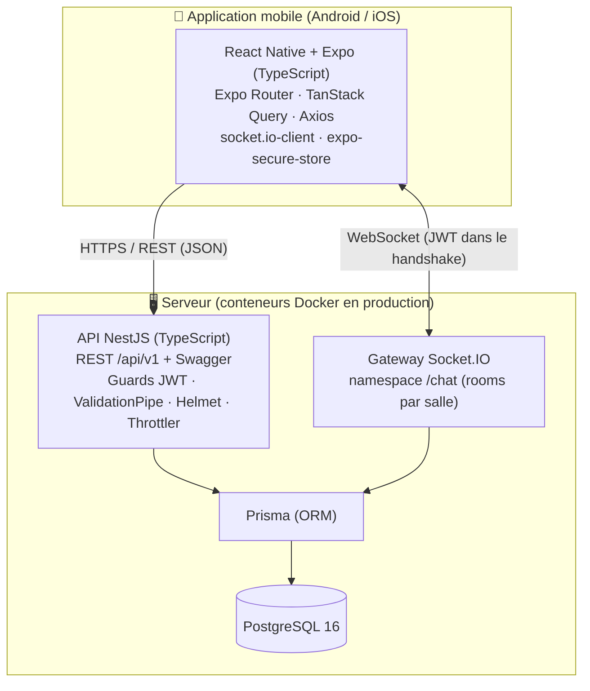
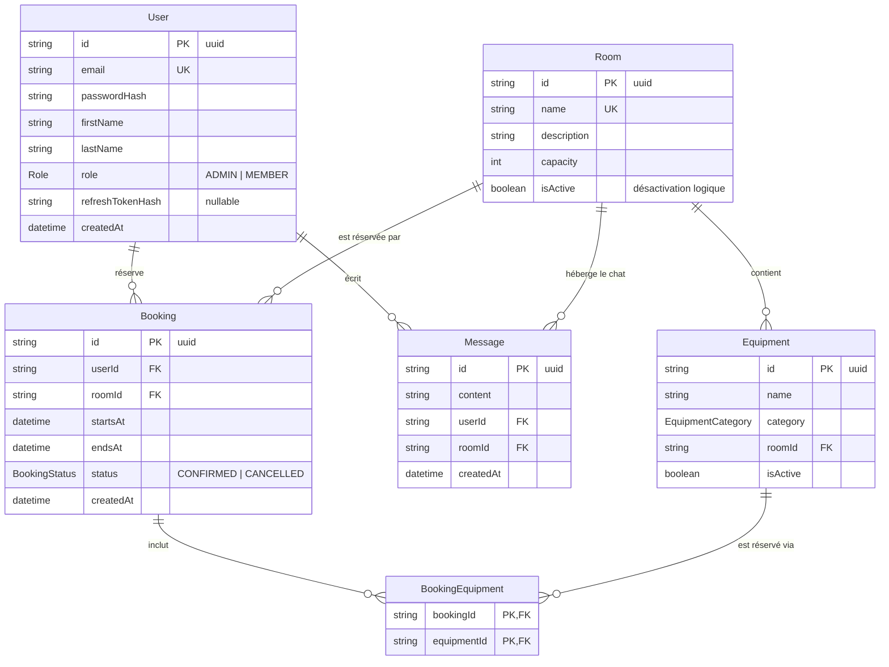

# Architecture logicielle — SoundProof

> **Compétence visée : C2.2.1** — Ce document présente l'architecture du prototype SoundProof : équipements ciblés, frameworks, paradigmes de développement, modèle de données, user stories et maquettes. Il est rédigé **avant** le développement des modules qu'il encadre.

## 1. Architecture globale



L'application mobile est le **seul client** ; elle communique avec l'API par deux canaux : REST (authentification, salles, réservations, historique du chat) et WebSocket (messages de chat en temps réel).

## 2. Justification des choix

### 2.1 Équipement ciblé : le mobile

Le critère C2.2.1 exige la prise en compte des **équipements ciblés**. SoundProof cible les **smartphones (Android en priorité, iOS par construction)** car l'usage est fondamentalement **nomade** :

- un musicien réserve une salle ou consulte les disponibilités **en déplacement** (entre deux cours, dans les transports, en sortant d'une répétition) — pas assis devant un poste ;
- le **chat de coordination** (échange de créneaux, prêt de matériel) n'a de valeur que si les notifications et la consultation sont immédiates, dans la poche ;
- le téléphone offre des atouts natifs inaccessibles au web classique : stockage sécurisé des tokens (Keychain/Keystore), reconnexion automatique du temps réel sur réseau instable, et à terme notifications push.

### 2.2 Frameworks et bibliothèques

| Choix                                   | Justification                                                                                                                                                                                                                                                                                       |
| --------------------------------------- | --------------------------------------------------------------------------------------------------------------------------------------------------------------------------------------------------------------------------------------------------------------------------------------------------- |
| **React Native + Expo**                 | Un seul code TypeScript pour Android **et** iOS ; écosystème React (composition de composants, hooks) ; outillage Expo décisif pour un projet solo : Expo Go (test immédiat sur appareil), builds cloud EAS (pas besoin d'Android Studio/Xcode configurés pour livrer), mises à jour OTA possibles. |
| **Expo Router**                         | Navigation **par fichiers** (`app/`) : les routes sont visibles dans l'arborescence, les groupes (`(tabs)`, `(admin)`) matérialisent les zones protégées, typage des routes activé.                                                                                                                 |
| **TanStack Query v5 + Axios**           | Gestion de l'« état serveur » (cache, invalidation après mutation, re-fetch à la reconnexion — précieux sur réseau mobile) ; Axios pour les intercepteurs (rafraîchissement automatique du token sur 401).                                                                                          |
| **NestJS**                              | Architecture **modulaire imposée** (un module par domaine métier), **injection de dépendances** native qui rend chaque service testable en isolation (mocks), écosystème intégré (Passport/JWT, ValidationPipe, Terminus, Swagger, WebSockets).                                                     |
| **Prisma**                              | Schéma déclaratif unique versionné, **migrations** reproductibles, client **entièrement typé** (le typage TypeScript va de la BDD à l'écran), requêtes paramétrées (protection injection SQL), Prisma Studio pour l'administration en dev.                                                          |
| **PostgreSQL 16**                       | SGBD relationnel robuste : les règles d'anti-chevauchement s'appuient sur des **transactions** ; index composites sur les créneaux.                                                                                                                                                                 |
| **Socket.IO**                           | **Rooms natives** qui épousent le besoin (une room = une salle de musique), **reconnexion automatique** avec ré-émission — indispensable sur réseau mobile (passage en arrière-plan, perte de 4G) ; intégration NestJS officielle (`@nestjs/websockets`).                                           |
| **JWT access (15 min) + refresh (7 j)** | Sessions sans état côté API ; le refresh token, stocké dans **expo-secure-store** et haché en BDD, permet de rester connecté entre deux ouvertures de l'app sans ressaisie (US2).                                                                                                                   |

> **Note de version — Expo SDK 54 plutôt que SDK 57** : le projet a d'abord été scaffoldé sur la dernière SDK stable (57), mais l'application **Expo Go** disponible sur l'appareil Android de développement est plafonnée à la SDK 54 (version d'Android de l'appareil trop ancienne pour les Expo Go récents, et Expo Go ne supporte qu'une seule SDK à la fois). Pour permettre le test quotidien sur appareil physique, le projet a été **aligné sur la SDK 54** (`npx expo install --fix` : React 19.1, React Native 0.81, expo-router 6, jest-expo 54…), l'intégralité du harnais (lint, typecheck, tests, expo-doctor, export) restant au vert. Ce choix n'affecte ni les fonctionnalités ni les builds EAS ; la montée vers la SDK la plus récente est documentée comme évolution dans `docs/11-manuel-mise-a-jour.md` (procédure `npx expo install --fix`).

> **Note de version — Prisma 6 plutôt que Prisma 7** : au moment du développement, la dernière majeure (Prisma 7) venait de sortir et introduit des changements structurels (client généré ESM-first hors de `node_modules`, fichier `prisma.config.ts` obligatoire, adaptateurs de driver, fin du chargement automatique du `.env`) encore peu compatibles avec l'outillage NestJS 11 en CommonJS et la documentation de l'écosystème. Conformément à la règle de gestion des blocages techniques du projet, la **dernière version stable de la branche 6 (6.19)** a été retenue : API éprouvée (`prisma-client-js`), migrations et seed identiques, aucune incidence fonctionnelle. La montée vers Prisma 7 est documentée comme évolution possible dans `docs/11-manuel-mise-a-jour.md`.

### 2.3 Paradigmes de développement

| Côté                  | Paradigmes                                                                                                                                                                                                                                                                                                                                                  |
| --------------------- | ----------------------------------------------------------------------------------------------------------------------------------------------------------------------------------------------------------------------------------------------------------------------------------------------------------------------------------------------------------- |
| Backend (NestJS)      | **Programmation orientée objet** : classes, décorateurs, encapsulation par module ; **injection de dépendances** (inversion de contrôle) : les services reçoivent leurs dépendances (PrismaService, JwtService…) via le constructeur, ce qui permet de les substituer par des mocks dans les tests. Pattern **Controller → Service → Repository (Prisma)**. |
| Mobile (React Native) | **Programmation fonctionnelle** : composants fonction purs, composition, hooks (état et effets isolés), immutabilité des états ; logique métier extraite en **fonctions pures** testables (`src/lib/`).                                                                                                                                                     |
| Transverse            | **Typage statique TypeScript strict** des deux côtés (`strict: true`) : les contrats d'API (DTOs) et les modèles Prisma portent les types de bout en bout.                                                                                                                                                                                                  |

## 3. Architecture backend

```
backend/src/
├── main.ts                  # bootstrap : ValidationPipe global, préfixe /api/v1, Helmet, Swagger (hors prod)
├── app.module.ts
├── prisma/                  # PrismaModule + PrismaService (connexion partagée)
├── auth/                    # AuthModule : register, login, refresh, logout
│   ├── guards/              #   JwtAuthGuard, RolesGuard (+ décorateur @Roles)
│   └── dto/                 #   DTOs validés par class-validator
├── users/                   # UsersModule : GET/PATCH /users/me
├── rooms/                   # RoomsModule : CRUD salles (écriture ADMIN)
├── equipment/               # EquipmentModule : CRUD matériel par salle (écriture ADMIN)
├── bookings/                # BookingsModule : règles métier anti-chevauchement (transactions)
├── chat/                    # ChatModule : gateway Socket.IO + historique REST paginé
└── health/                  # HealthModule : GET /health (@nestjs/terminus)
```

- **Pattern Controller → Service → Repository** : le contrôleur ne fait que valider (DTO) et déléguer ; le service porte la logique métier ; l'accès aux données passe exclusivement par Prisma. Cette séparation stricte des responsabilités garantit la **maintenabilité** : chaque couche se teste et évolue indépendamment.
- **DTOs `class-validator`** sur 100 % des entrées (`whitelist: true, forbidNonWhitelisted: true`) ; DTOs de sortie / `select` Prisma explicites pour ne jamais exposer `passwordHash` ni `refreshTokenHash`.
- **Sécurité transverse** : Helmet, rate limiting (`@nestjs/throttler` — global 100 req/min, 5 req/min sur login/register), guards JWT + rôles, contrôles d'accès **toujours côté API** (un APK se décompile — voir `docs/05-securite-owasp.md`).

### Modules et responsabilités

| Module            | Responsabilité                                                                                                            |
| ----------------- | ------------------------------------------------------------------------------------------------------------------------- |
| `AuthModule`      | register, login, refresh, logout ; stratégie JWT (Passport) ; guards `JwtAuthGuard`, `RolesGuard` + décorateur `@Roles()` |
| `UsersModule`     | profil courant (`GET/PATCH /users/me`)                                                                                    |
| `RoomsModule`     | CRUD salles (écriture ADMIN), liste + détail pour tout utilisateur authentifié, disponibilités                            |
| `EquipmentModule` | CRUD matériel par salle (écriture ADMIN)                                                                                  |
| `BookingsModule`  | création/annulation de réservations, règles métier critiques (§ 6), disponibilité                                         |
| `ChatModule`      | gateway Socket.IO (namespace `/chat`) + historique REST paginé des messages                                               |
| `HealthModule`    | `GET /health` (statut app + BDD) via `@nestjs/terminus`                                                                   |

### Contrat d'API REST (préfixe global `/api/v1`)

| Méthode           | Route                             | Accès                 | Description                                                        |
| ----------------- | --------------------------------- | --------------------- | ------------------------------------------------------------------ |
| POST              | `/auth/register`                  | public                | inscription                                                        |
| POST              | `/auth/login`                     | public                | connexion → access + refresh tokens                                |
| POST              | `/auth/refresh`                   | refresh token         | renouvellement                                                     |
| POST              | `/auth/logout`                    | authentifié           | invalidation du refresh token                                      |
| GET/PATCH         | `/users/me`                       | authentifié           | profil                                                             |
| GET               | `/rooms`                          | authentifié           | liste des salles actives + équipements                             |
| GET               | `/rooms/:id`                      | authentifié           | détail d'une salle                                                 |
| GET               | `/rooms/:id/availability?from&to` | authentifié           | créneaux occupés sur la période                                    |
| POST/PATCH/DELETE | `/rooms…`                         | ADMIN                 | gestion des salles (DELETE = désactivation logique)                |
| POST/PATCH/DELETE | `/rooms/:id/equipment…`           | ADMIN                 | gestion du matériel                                                |
| POST              | `/bookings`                       | authentifié           | créer une réservation `{roomId, startsAt, endsAt, equipmentIds[]}` |
| GET               | `/bookings/me`                    | authentifié           | mes réservations                                                   |
| GET               | `/bookings`                       | ADMIN                 | toutes les réservations (filtres salle/date)                       |
| DELETE            | `/bookings/:id`                   | propriétaire ou ADMIN | annulation                                                         |
| GET               | `/rooms/:id/messages?cursor`      | membre de la salle    | historique paginé du chat                                          |
| GET               | `/health`                         | public                | healthcheck                                                        |

L'API est documentée avec `@nestjs/swagger`, exposée sur `/api/docs` **hors production**.

### Événements Socket.IO (namespace `/chat`)

| Sens              | Événement      | Payload                     | Règle                                                                 |
| ----------------- | -------------- | --------------------------- | --------------------------------------------------------------------- |
| client → serveur  | `room:join`    | `{ roomId }`                | vérifie la règle d'accès au chat (§ 6.5), rejoint la room `room:<id>` |
| client → serveur  | `room:leave`   | `{ roomId }`                | quitte la room                                                        |
| client → serveur  | `message:send` | `{ roomId, content }`       | valide (1-1000 caractères), persiste en BDD, diffuse                  |
| serveur → clients | `message:new`  | message complet avec auteur | diffusé à la room                                                     |
| serveur → client  | `error`        | `{ code, message }`         | accès refusé / validation                                             |

L'authentification WebSocket se fait via le **JWT passé dans `auth` du handshake** Socket.IO, vérifié dans le gateway. Côté mobile, la **reconnexion** est gérée explicitement : re-join automatique de la room et rafraîchissement de l'historique au retour au premier plan.

## 4. Architecture mobile

```
mobile/
├── app/                        # Écrans = routes (Expo Router)
│   ├── _layout.tsx             # Providers (AuthProvider, QueryClientProvider)
│   ├── login.tsx, register.tsx # Zone publique
│   ├── (tabs)/                 # Zone authentifiée : barre d'onglets en bas
│   │   ├── rooms.tsx           #   Salles
│   │   ├── bookings.tsx        #   Mes réservations
│   │   ├── admin.tsx           #   Administration (visible ADMIN uniquement)
│   │   └── profile.tsx         #   Profil + déconnexion
│   └── rooms/[id]/             # Détail salle, réservation, chat
├── src/
│   ├── api/          # Instance Axios + fonctions d'appel API par domaine
│   ├── components/   # Button, Input, Modal, Toast, Spinner, EmptyState, Card…
│   ├── features/     # Logique par fonctionnalité (auth, bookings, chat)
│   ├── hooks/        # Hooks partagés (useAuth, useSocket…)
│   └── lib/          # Fonctions pures (calcul de créneaux, thème)
```

- **État serveur** : TanStack Query (clés de cache normalisées, invalidation après mutation, `refetchOnReconnect`).
- **État local** : hooks React (`useState`, contexte `AuthProvider`).
- **Tokens** : access token **en mémoire** uniquement ; refresh token dans **expo-secure-store** (Keychain iOS / Keystore Android, stockage chiffré natif).
- **Protection des routes** : layouts Expo Router redirigeant vers `/login` si non authentifié ; onglet admin rendu uniquement pour le rôle ADMIN (et contrôlé côté API dans tous les cas).
- **Client HTTP** : intercepteur Axios qui rejoue la requête après rafraîchissement du token sur 401 (une seule tentative, puis déconnexion).

## 5. Modèle de données



Points de conception notables :

- **Annulation logique** (`status: CANCELLED`) plutôt que suppression : traçabilité des réservations (exigence sécurité A04).
- **`BookingEquipment`** : table de jointure — le matériel n'est réservable que **dans le cadre d'une réservation de salle** (suppression en cascade avec la réservation).
- Index composites `(roomId, startsAt, endsAt)` sur `Booking` et `(roomId, createdAt)` sur `Message` : les deux requêtes les plus fréquentes (recherche de chevauchement, pagination du chat).

## 6. Règles métier critiques (implémentées dans `BookingsService`, testées en priorité)

1. `startsAt < endsAt`, créneau **dans le futur**, durée entre **30 min et 8 h**, alignement sur des pas de **30 min**.
2. **Anti-chevauchement salle** : refus (HTTP 409) si un booking `CONFIRMED` existe sur la même salle avec `startsAt < newEnd AND endsAt > newStart`. Contrôle effectué dans une **transaction Prisma** (`$transaction` : vérification + insertion atomiques) pour éviter les conditions de course entre deux réservations simultanées.
3. **Anti-chevauchement matériel** : même règle pour chaque équipement demandé ; l'équipement doit **appartenir à la salle réservée**.
4. **Annulation** : possible uniquement par le propriétaire ou un ADMIN, uniquement si `startsAt` est dans le futur ; statut → `CANCELLED` (pas de suppression).
5. **Accès au chat** : autorisé si l'utilisateur possède au moins un booking `CONFIRMED` (passé ou futur) sur la salle, ou s'il est ADMIN.

## 7. User stories et critères d'acceptation

| #        | User story                                                                                                                                                                                          | Critères d'acceptation                                                                                                                                                                                                             |
| -------- | --------------------------------------------------------------------------------------------------------------------------------------------------------------------------------------------------- | ---------------------------------------------------------------------------------------------------------------------------------------------------------------------------------------------------------------------------------- |
| **US1**  | En tant que **visiteur**, je peux créer un compte avec email + mot de passe fort, afin d'accéder à l'application.                                                                                   | Mot de passe ≥ 12 caractères avec minuscule, majuscule et chiffre ; email unique (erreur claire si déjà pris) ; erreurs de formulaire affichées champ par champ ; redirection vers l'app connectée après inscription.              |
| **US2**  | En tant qu'**utilisateur**, je peux me connecter et rester connecté entre deux ouvertures de l'app, afin de ne pas ressaisir mes identifiants.                                                      | Login avec message générique en cas d'échec (« identifiants invalides ») ; refresh token en stockage sécurisé natif ; à la réouverture de l'app, session restaurée sans ressaisie ; logout invalide le refresh token côté serveur. |
| **US3**  | En tant que **membre**, je peux consulter la liste des salles avec leur équipement, afin de choisir une salle adaptée.                                                                              | Liste des salles actives avec nom, capacité et équipements ; pull-to-refresh ; états vide / chargement / erreur distincts.                                                                                                         |
| **US4**  | En tant que **membre**, je peux voir les disponibilités d'une salle sur une semaine, afin de choisir un créneau libre.                                                                              | Grille hebdomadaire par pas de 30 min ; créneaux occupés visuellement distincts (et non sélectionnables) ; navigation semaine précédente/suivante.                                                                                 |
| **US5**  | En tant que **membre**, je peux réserver une salle sur un créneau, et le système refuse tout chevauchement, afin de garantir l'exclusivité du créneau.                                              | Réservation visible immédiatement dans « Mes réservations » avec confirmation (toast) ; tentative en conflit → HTTP 409 et message exploitable ; règles de validité du créneau (§ 6.1) appliquées.                                 |
| **US6**  | En tant que **membre**, je peux ajouter du matériel de la salle à ma réservation, et le système refuse un matériel déjà réservé sur un créneau chevauchant, afin d'éviter les conflits de matériel. | Seul le matériel de la salle est proposé ; matériel indisponible sur le créneau signalé ; conflit → 409 avec le nom du matériel en cause.                                                                                          |
| **US7**  | En tant que **membre**, je peux consulter et annuler mes réservations à venir, afin de gérer mon planning.                                                                                          | Onglets « à venir » / « passées » ; annulation avec **dialogue de confirmation natif** ; réservation passée non annulable ; statut CANCELLED visible.                                                                              |
| **US8**  | En tant que **membre ayant une réservation** dans une salle, je peux accéder au chat de cette salle et échanger en temps réel, afin de me coordonner.                                               | Accès refusé sans réservation sur la salle ; messages reçus en < 500 ms en local ; historique paginé (scroll infini) ; reconnexion automatique au retour au premier plan avec récupération des messages manqués.                   |
| **US9**  | En tant qu'**admin**, je peux créer/modifier/désactiver des salles et leur matériel, afin de gérer le parc.                                                                                         | Écritures réservées au rôle ADMIN (403 sinon) ; désactivation logique (la salle disparaît de la liste des membres mais l'historique subsiste).                                                                                     |
| **US10** | En tant qu'**admin**, je peux consulter et annuler n'importe quelle réservation, afin de gérer les imprévus.                                                                                        | Liste de toutes les réservations avec filtres salle/date ; annulation par l'admin possible sur toute réservation future.                                                                                                           |

## 8. Maquettes basse fidélité (6 écrans principaux)

Orientation **portrait verrouillée** (usage à une main, formulaires et listes verticales — choix documenté). Navigation principale : **barre d'onglets en bas** (zone du pouce) : `Salles · Réservations · Admin (si ADMIN) · Profil`.

### 8.1 Connexion / Inscription (`/login`, `/register`)

```
┌──────────────────────────────┐
│          SoundProof 🎸       │
│                              │
│  Email                       │
│  ┌────────────────────────┐  │
│  └────────────────────────┘  │
│  Mot de passe                │
│  ┌────────────────────────┐  │
│  └────────────────────────┘  │
│  (erreur champ sous le champ)│
│                              │
│  ┌────────────────────────┐  │
│  │      Se connecter      │  │ ← bouton ≥ 44 pt, état chargement (spinner)
│  └────────────────────────┘  │
│   Pas de compte ? S'inscrire │
└──────────────────────────────┘
```

Ergonomie : `KeyboardAvoidingView` (le clavier ne masque jamais le champ actif), validation zod avec erreurs **annoncées** aux lecteurs d'écran, message d'échec générique (sécurité).

### 8.2 Liste des salles (`/(tabs)/rooms`)

```
┌──────────────────────────────┐
│  Salles              (titre) │
│ ┌──────────────────────────┐ │
│ │ Studio A       👥 6 pers │ │ ← Card tactile (≥44pt)
│ │ 🎸 ampli ×2 · 🥁 batterie │ │
│ └──────────────────────────┘ │
│ ┌──────────────────────────┐ │
│ │ Studio B       👥 4 pers │ │
│ │ 🎤 micros ×3 · 🎹 clavier │ │
│ └──────────────────────────┘ │
│  (pull-to-refresh ↓)         │
│  (vide → EmptyState illustré)│
├──────────────────────────────┤
│  🏠 Salles ▸ 📅 Résa  👤 Profil │ ← onglets en bas (pouce)
└──────────────────────────────┘
```

### 8.3 Détail salle + calendrier (`/rooms/[id]`)

```
┌──────────────────────────────┐
│ ← Studio A          👥 6     │
│ Description, équipements     │
│                              │
│  ◀ Semaine du 12 mai ▶       │
│ ┌───┬───┬───┬───┬───┬───┬──┐ │
│ │Lun│Mar│Mer│Jeu│Ven│Sam│Di│ │
│ │▓▓▓│   │   │▓▓▓│   │   │  │ │ ← ▓ = occupé (grisé, non
│ │   │   │▓▓▓│   │   │   │  │ │    sélectionnable), pas 30 min
│ └───┴───┴───┴───┴───┴───┴──┘ │
│  Créneau choisi : 10:00-12:00│
│ ┌────────────────────────┐   │
│ │        Réserver        │   │
│ └────────────────────────┘   │
│  💬 Chat de la salle         │ ← visible si réservation
└──────────────────────────────┘
```

### 8.4 Formulaire de réservation (salle + matériel)

```
┌──────────────────────────────┐
│ ← Réserver — Studio A        │
│  Créneau : lun 12 mai        │
│  Début  [10:00 ▾]  (pas 30') │
│  Fin    [12:00 ▾]            │
│                              │
│  Matériel supplémentaire :   │
│  ☑ Ampli Marshall            │
│  ☐ Micro Shure SM58          │
│  ☒ Table de mixage (occupée) │ ← indisponible sur le créneau
│                              │
│ ┌────────────────────────┐   │
│ │   Confirmer la résa    │   │ → toast succès / erreur 409 lisible
│ └────────────────────────┘   │
└──────────────────────────────┘
```

### 8.5 Mes réservations (`/(tabs)/bookings`)

```
┌──────────────────────────────┐
│  Mes réservations            │
│  [ À venir ]  [ Passées ]    │ ← segmented control
│ ┌──────────────────────────┐ │
│ │ Studio A — lun 12 mai    │ │
│ │ 10:00-12:00  + 1 matériel │ │
│ │            [ Annuler ]   │ │ → Alert natif de confirmation
│ └──────────────────────────┘ │
│  (pull-to-refresh, EmptyState│
│   « Aucune réservation »)    │
├──────────────────────────────┤
│  🏠 Salles  📅 Résa ▸ 👤 Profil │
└──────────────────────────────┘
```

### 8.6 Chat de salle (`/rooms/[id]/chat`)

```
┌──────────────────────────────┐
│ ← Chat — Studio A   ● en ligne│ ← indicateur de connexion
│ ┌──────────────────────────┐ │
│ │ Marie · 14:02            │ │
│ │ Quelqu'un a un câble XLR ?│ │
│ │            Moi · 14:05   │ │
│ │      Oui je l'amène ! ✔  │ │
│ └──────────────────────────┘ │ ← FlatList inversée, scroll
│  (scroll ↑ = messages + anciens) │   infini par cursor
│ ┌───────────────────┐ ┌────┐ │
│ │ Votre message…    │ │ ➤  │ │ ← envoi ; nouveau message
│ └───────────────────┘ └────┘ │   annoncé au lecteur d'écran
└──────────────────────────────┘
```

### Choix ergonomiques mobiles transverses

- **Barre d'onglets en bas** : accessible au pouce sur grand écran, standard des deux plateformes.
- **Zones tactiles ≥ 44×44 pt** partout (boutons, cases, lignes de liste).
- **Gestes standards** : pull-to-refresh sur toutes les listes, retour par geste système.
- **Feedback systématique** : toute action asynchrone a un état de chargement visible et un toast succès/erreur exploitable ; états **vide / chargement / erreur** distincts sur chaque liste.
- **Clavier virtuel** : `KeyboardAvoidingView` sur tous les formulaires — le champ actif et le bouton de validation restent visibles.
- **SafeAreaView** partout (encoches, barres système).
- **Portrait verrouillé** : parcours de réservation et chat sont des flux verticaux ; le paysage n'apporte rien et complexifie les grilles — choix assumé et documenté.
- **Accessibilité dès la conception** : rôles et labels sur tous les éléments interactifs, contrastes ≥ 4.5:1 dans le thème, tailles de police dynamiques respectées (voir `docs/06-accessibilite.md`).

## 9. Écrans → routes Expo Router

| Route                 | Écran                | Contenu clé                                                                                |
| --------------------- | -------------------- | ------------------------------------------------------------------------------------------ |
| `/login`, `/register` | Auth                 | formulaires react-hook-form + zod, erreurs annoncées, clavier géré                         |
| `/(tabs)/rooms`       | Liste des salles     | cartes salle, pull-to-refresh, états vide/chargement/erreur                                |
| `/rooms/[id]`         | Détail + réservation | grille hebdomadaire (pas 30 min), créneaux occupés grisés, matériel à cocher, confirmation |
| `/(tabs)/bookings`    | Mes réservations     | à venir / passées, annulation avec Alert natif                                             |
| `/rooms/[id]/chat`    | Chat de salle        | FlatList inversée + cursor, temps réel, indicateur de connexion                            |
| `/(tabs)/admin`       | Administration       | CRUD salles/matériel, toutes les réservations (onglet ADMIN uniquement)                    |
