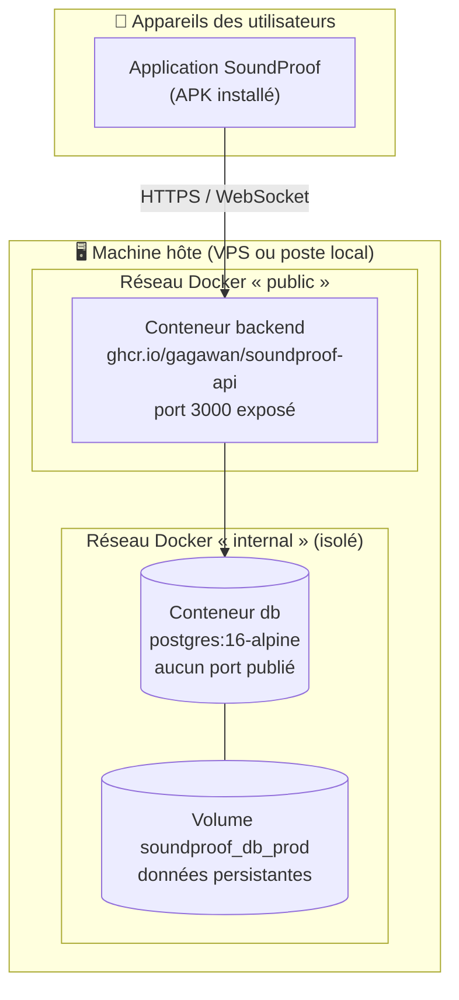

# Manuel de déploiement — SoundProof

> **Compétence visée : C2.4.1** — Ce manuel s'adresse à une personne **ne connaissant pas le projet**. Il permet de déployer l'intégralité de la solution depuis zéro : l'**API** (conteneurs Docker) et l'**application mobile** (APK Android produit par EAS Build).
>
> Deux parties indépendantes : [Partie A — API](#partie-a--déploiement-de-lapi) et [Partie B — Application mobile](#partie-b--déploiement-de-lapplication-mobile).

## Vue d'ensemble de l'architecture déployée



Points structurants :

- La **base de données n'est jamais joignable depuis l'extérieur** : elle vit sur un réseau Docker `internal`, sans port publié. Seule l'API la voit.
- L'API **doit** être joignable par les téléphones : c'est le seul port exposé (3000).
- Les données PostgreSQL sont dans un **volume nommé** : elles survivent à la destruction et à la recréation des conteneurs.
- Les **migrations de base sont appliquées automatiquement** au démarrage du conteneur backend (entrypoint), avant que l'API n'accepte des requêtes.

---

# Partie A — Déploiement de l'API

## A.1 Prérequis

| Élément            | Version minimale                            | Vérification             |
| ------------------ | ------------------------------------------- | ------------------------ |
| **Docker Engine**  | 24+                                         | `docker --version`       |
| **Docker Compose** | v2 (intégré à Docker)                       | `docker compose version` |
| **git**            | 2.x                                         | `git --version`          |
| Accès réseau       | Port 3000 ouvert vers les appareils clients | —                        |

Aucune installation de Node.js, PostgreSQL ou Prisma n'est nécessaire sur la machine cible : tout est conteneurisé.

## A.2 Variables d'environnement

À définir dans un fichier `.env` **à la racine du dépôt, sur la machine cible**. Ce fichier n'est **jamais** committé ; un modèle est fourni : `.env.prod.example`.

| Variable             | Description                                                                     | Exemple                          | Obligatoire           |
| -------------------- | ------------------------------------------------------------------------------- | -------------------------------- | --------------------- |
| `API_VERSION`        | Tag de l'image API à déployer (version SemVer ou `latest`)                      | `v1.0.0`                         | Non (défaut `latest`) |
| `POSTGRES_USER`      | Utilisateur PostgreSQL créé au premier démarrage                                | `soundproof`                     | **Oui**               |
| `POSTGRES_PASSWORD`  | Mot de passe de cet utilisateur — **valeur forte et unique**                    | `xK9…`                           | **Oui**               |
| `POSTGRES_DB`        | Nom de la base                                                                  | `soundproof`                     | **Oui**               |
| `JWT_ACCESS_SECRET`  | Secret de signature des jetons d'accès                                          | chaîne aléatoire ≥ 64 caractères | **Oui**               |
| `JWT_REFRESH_SECRET` | Secret de signature des jetons de rafraîchissement — **différent du précédent** | chaîne aléatoire ≥ 64 caractères | **Oui**               |
| `JWT_ACCESS_TTL`     | Durée de vie du jeton d'accès                                                   | `15m`                            | Non (défaut `15m`)    |
| `JWT_REFRESH_TTL`    | Durée de vie du jeton de rafraîchissement                                       | `7d`                             | Non (défaut `7d`)     |

> ⚠️ **Le déploiement échoue volontairement au démarrage** si une variable obligatoire est absente (contrôle `${VAR:?requis}` dans `docker-compose.prod.yml`) — cela évite de démarrer avec des secrets par défaut.

**Génération des secrets** :

```bash
openssl rand -hex 64   # à exécuter deux fois : un secret pour l'access, un pour le refresh
```

## A.3 Déploiement pas à pas (machine vierge)

```bash
# 1. Récupérer le code
git clone https://github.com/Gagawan/SoundProof.git
cd SoundProof

# 2. Créer le fichier de configuration à partir du modèle
cp .env.prod.example .env

# 3. Éditer .env : renseigner les mots de passe et les deux secrets JWT
#    (voir A.2 — ne jamais conserver les valeurs d'exemple)
nano .env

# 4. Récupérer l'image de l'API et démarrer la pile
docker compose -f docker-compose.prod.yml pull
docker compose -f docker-compose.prod.yml up -d

# 5. Vérifier que tout tourne
docker compose -f docker-compose.prod.yml ps
```

Les deux conteneurs doivent apparaître **`running`**, et `db` avec l'état **`healthy`**.

> **Note** : l'image de l'API est publiée sur GitHub Container Registry par le pipeline de déploiement continu. Si le dépôt est privé, s'authentifier au préalable :
> `echo <TOKEN_GITHUB> | docker login ghcr.io -u <utilisateur> --password-stdin`

## A.4 Initialisation de la base de données

**Les migrations sont automatiques.** Au démarrage du conteneur backend, l'entrypoint exécute `prisma migrate deploy` : le schéma est créé (premier déploiement) ou mis à jour (déploiements suivants) avant que l'API ne démarre.

Vérification dans les logs :

```bash
docker compose -f docker-compose.prod.yml logs backend | head -20
# Attendu : « Application des migrations Prisma… » puis le démarrage de Nest
```

**Jeu de données de démonstration (optionnel)** — utile pour une recette ou une démonstration. Il crée 4 comptes (1 administrateur, 3 membres), 3 salles avec leur matériel, des réservations et des messages ; les identifiants sont listés dans `docs/07-cahier-de-recettes.md` § 1.2.

> ⚠️ **Le seed purge les tables avant de les remplir** : ne jamais l'exécuter sur une base contenant des données réelles.

> ℹ️ Le script de seed est écrit en TypeScript et s'appuie sur `ts-node`, une dépendance de développement **absente de l'image de production** (allégée par `npm prune --omit=dev`). Il n'est donc pas exécutable directement dans le conteneur : la procédure ci-dessous le lance depuis une copie du dépôt.

```bash
# Sur une machine disposant du dépôt et de Node.js 20+

# 1. Exposer temporairement la base sur la boucle locale de la machine hôte
#    (127.0.0.1 uniquement — jamais 0.0.0.0)
docker compose -f docker-compose.prod.yml exec db true   # vérifie que la base tourne
docker run --rm -d --name sp-tunnel \
  --network container:$(docker compose -f docker-compose.prod.yml ps -q db) \
  -p 127.0.0.1:5433:5432 alpine/socat \
  TCP-LISTEN:5432,fork TCP:127.0.0.1:5432

# 2. Lancer le seed depuis le dépôt, en pointant sur ce tunnel
cd backend && npm install
DATABASE_URL="postgresql://<POSTGRES_USER>:<POSTGRES_PASSWORD>@127.0.0.1:5433/<POSTGRES_DB>?schema=public" \
  npx prisma db seed

# 3. Refermer immédiatement le tunnel
docker rm -f sp-tunnel
```

**Alternative plus simple en environnement de démonstration** : ajouter temporairement `ports: ['127.0.0.1:5433:5432']` au service `db` dans `docker-compose.prod.yml`, exécuter le seed comme ci-dessus (étape 2), puis **retirer la ligne et relancer `up -d`**. Dans les deux cas, la base ne doit jamais rester exposée après l'opération.

**Créer un compte administrateur sur une base vierge** — l'inscription depuis l'application crée toujours un compte `MEMBER`. Pour promouvoir un compte existant :

```bash
docker compose -f docker-compose.prod.yml exec db \
  sh -c 'psql -U "$POSTGRES_USER" -d "$POSTGRES_DB" -c "UPDATE \"User\" SET role='"'"'ADMIN'"'"' WHERE email='"'"'admin@exemple.fr'"'"';"'
```

> 💡 Les commandes ci-dessous encapsulent `psql`/`pg_dump` dans `sh -c '…'` : les variables `$POSTGRES_USER` et `$POSTGRES_DB` sont ainsi résolues **dans le conteneur** (où elles sont définies) et non par le shell de la machine hôte, où elles ne le sont pas.

## A.5 Vérification post-déploiement

| #   | Contrôle                        | Commande / action                                                 | Résultat attendu                                     |
| --- | ------------------------------- | ----------------------------------------------------------------- | ---------------------------------------------------- |
| 1   | Conteneurs actifs               | `docker compose -f docker-compose.prod.yml ps`                    | `backend` et `db` en `running`, `db` `healthy`       |
| 2   | Santé de l'API et de la base    | `curl http://localhost:3000/api/v1/health`                        | `{"status":"ok",…"database":{"status":"up"}}`        |
| 3   | Routes protégées                | `curl -i http://localhost:3000/api/v1/rooms`                      | **401** (et non 500) — l'authentification est active |
| 4   | Documentation d'API non exposée | `curl -i http://localhost:3000/api/docs`                          | **404** — Swagger est désactivé en production        |
| 5   | Base non exposée                | `curl -i http://localhost:5432`                                   | Connexion refusée — aucun port PostgreSQL publié     |
| 6   | Smoke test fonctionnel          | Depuis l'application : se connecter, afficher la liste des salles | Connexion réussie, salles affichées                  |

## A.6 Exposition aux téléphones et HTTPS

**En réseau local** (démonstration) : les appareils joignent l'API via l'adresse IP locale de la machine hôte, par exemple `http://192.168.1.42:3000`. Vérifier que le pare-feu autorise le port 3000 en entrée.

**Sur Internet (production)** : le trafic **doit** être chiffré. Placer un reverse proxy assurant la terminaison TLS devant l'API (Caddy, Traefik ou Nginx + Let's Encrypt), puis pointer l'application vers `https://api.mon-domaine.fr`.

Exemple minimal avec Caddy (certificat automatique) :

```
api.mon-domaine.fr {
    reverse_proxy localhost:3000
}
```

Une fois le proxy en place, ne plus exposer le port 3000 directement sur Internet (le restreindre à `127.0.0.1:3000` dans `docker-compose.prod.yml`).

## A.7 Procédure de rollback

Chaque version publiée produit une image Docker **immuable** taguée (`v1.0.0`, `v1.1.0`…). Revenir à la version précédente :

```bash
# 1. Éditer .env : API_VERSION=v1.0.0 (version antérieure connue comme stable)
nano .env

# 2. Récupérer et redémarrer
docker compose -f docker-compose.prod.yml pull
docker compose -f docker-compose.prod.yml up -d

# 3. Vérifier
curl http://localhost:3000/api/v1/health
```

> ⚠️ **Attention aux migrations** : les migrations Prisma sont additives, mais si la version que l'on quitte a modifié le schéma de manière incompatible, un retour arrière de schéma peut être nécessaire — procédure détaillée dans `docs/11-manuel-mise-a-jour.md`. **Toujours réaliser une sauvegarde avant une mise à jour** (§ A.8).

## A.8 Sauvegarde et restauration

### Sauvegarde

```bash
# Sauvegarde complète, horodatée
docker compose -f docker-compose.prod.yml exec -T db \
  sh -c 'pg_dump -U "$POSTGRES_USER" -d "$POSTGRES_DB" -F c' \
  > sauvegarde-soundproof-$(date +%Y%m%d-%H%M).dump
```

Recommandations : sauvegarde **avant chaque mise à jour**, sauvegarde quotidienne automatisée (tâche `cron`), conservation d'au moins 7 jours, et **copie hors de la machine hôte**.

Exemple d'automatisation quotidienne à 3 h :

```cron
0 3 * * * cd /chemin/vers/SoundProof && docker compose -f docker-compose.prod.yml exec -T db pg_dump -U soundproof -d soundproof -F c > /sauvegardes/soundproof-$(date +\%Y\%m\%d).dump
```

### Restauration

```bash
# 1. Arrêter l'API (la base reste active)
docker compose -f docker-compose.prod.yml stop backend

# 2. Restaurer (--clean supprime les objets existants avant recréation)
docker compose -f docker-compose.prod.yml exec -T db \
  sh -c 'pg_restore -U "$POSTGRES_USER" -d "$POSTGRES_DB" --clean --if-exists' \
  < sauvegarde-soundproof-20260714-0300.dump

# 3. Redémarrer l'API
docker compose -f docker-compose.prod.yml start backend
curl http://localhost:3000/api/v1/health
```

## A.9 Exploitation courante

| Besoin                                  | Commande                                                                             |
| --------------------------------------- | ------------------------------------------------------------------------------------ |
| Consulter les logs de l'API             | `docker compose -f docker-compose.prod.yml logs -f backend`                          |
| Consulter les logs de la base           | `docker compose -f docker-compose.prod.yml logs -f db`                               |
| Redémarrer l'API                        | `docker compose -f docker-compose.prod.yml restart backend`                          |
| Arrêter la pile                         | `docker compose -f docker-compose.prod.yml down`                                     |
| Arrêter **et supprimer les données** ⚠️ | `docker compose -f docker-compose.prod.yml down -v`                                  |
| Ouvrir une console SQL                  | `docker compose -f docker-compose.prod.yml exec db psql -U soundproof -d soundproof` |

Les journaux de l'API tracent notamment les échecs d'authentification et les refus d'accès (sans donnée sensible) — voir `docs/05-securite-owasp.md` (A09).

## A.10 Dépannage — API

| Symptôme                                   | Cause probable                                                  | Solution                                                                                                                           |
| ------------------------------------------ | --------------------------------------------------------------- | ---------------------------------------------------------------------------------------------------------------------------------- |
| `POSTGRES_PASSWORD requis` au démarrage    | Variable absente du `.env`                                      | Compléter le `.env` (§ A.2), puis `up -d`                                                                                          |
| Le conteneur `backend` redémarre en boucle | Base pas encore prête, ou `DATABASE_URL` erronée                | `logs backend` ; vérifier que `db` est `healthy` ; vérifier les identifiants du `.env`                                             |
| `/health` renvoie `database: down`         | Base arrêtée ou identifiants invalides                          | `logs db` ; vérifier que le mot de passe du `.env` correspond à celui du volume existant                                           |
| Port 3000 déjà utilisé                     | Autre service (ou API résiduelle) sur le port                   | `netstat -ano \| grep 3000` (Windows) ou `lsof -i :3000` (Linux) ; arrêter le processus ou changer le port publié                  |
| Erreur d'authentification au `pull`        | Image privée sur ghcr.io                                        | `docker login ghcr.io` avec un token disposant du scope `read:packages`                                                            |
| Mot de passe changé mais connexion refusée | Le mot de passe PostgreSQL est fixé à la **création** du volume | Restaurer l'ancien mot de passe, ou changer le mot de passe via `psql`, ou recréer le volume (⚠️ perte de données sans sauvegarde) |
| Les migrations ne s'appliquent pas         | Entrypoint non exécuté (image obsolète)                         | Vérifier `logs backend` ; forcer `pull` de l'image et recréer le conteneur                                                         |

---

# Partie B — Déploiement de l'application mobile

## B.1 Prérequis

| Élément                 | Détail                                                                           |
| ----------------------- | -------------------------------------------------------------------------------- |
| **Compte Expo**         | Gratuit — https://expo.dev                                                       |
| **Node.js 20+** et npm  | Pour la CLI EAS                                                                  |
| **Projet lié à EAS**    | Déjà fait : `extra.eas.projectId` présent dans `mobile/app.json`                 |
| **Secret `EXPO_TOKEN`** | Pour les builds automatisés en CI (Settings → Secrets → Actions du dépôt GitHub) |
| **API accessible**      | L'URL configurée dans le profil de build doit être joignable par les appareils   |

## B.2 Configuration de l'URL de l'API

L'application ne contient **aucun secret** : la seule variable embarquée est l'URL de l'API (rappel : les variables `EXPO_PUBLIC_*` sont lisibles dans l'APK — voir `docs/05-securite-owasp.md` A05).

Elle est définie **par profil de build** dans [`mobile/eas.json`](../mobile/eas.json) :

| Profil       | Artefact                                               | Variable `EXPO_PUBLIC_API_URL` |
| ------------ | ------------------------------------------------------ | ------------------------------ |
| `preview`    | **APK** installable directement (distribution interne) | URL de l'API de démonstration  |
| `production` | **AAB** (format Google Play)                           | URL de l'API de production     |

Avant tout build, **vérifier que l'URL du profil correspond à l'API réellement déployée** (§ A.6).

## B.3 Produire un APK (profil `preview`)

C'est le binaire remis pour évaluation et démonstration.

```bash
cd mobile
npm install
npx eas login                 # une seule fois, avec le compte Expo
npx eas build --platform android --profile preview
```

Le build s'exécute **sur les serveurs d'Expo** (aucun Android Studio requis). Comptez 10 à 20 minutes selon la file d'attente. À la fin, la CLI affiche une **URL de téléchargement** et un **QR code**.

> Le keystore de signature Android est généré et conservé par EAS au premier build : tous les builds suivants sont signés de manière cohérente — condition nécessaire pour qu'Android accepte les mises à jour de l'application.

## B.4 Installer l'APK sur un appareil Android

1. **Télécharger** l'APK : via le QR code affiché par EAS, le lien du tableau de bord https://expo.dev, ou la GitHub Release (§ B.5).
2. **Autoriser l'installation depuis une source inconnue** : Android affiche un avertissement à la première installation hors Play Store. Aller dans _Paramètres → Applications → Accès spécial → Installer des applications inconnues_, puis autoriser l'application utilisée (navigateur ou gestionnaire de fichiers).
3. **Ouvrir le fichier téléchargé** et confirmer l'installation.
4. **Lancer SoundProof** et se connecter.

## B.5 Distribution automatisée

Le pipeline de déploiement continu ([`.github/workflows/cd.yml`](../.github/workflows/cd.yml)) automatise la production et la diffusion à chaque tag de version `vX.Y.Z` :

1. Exécution complète de l'intégration continue ;
2. Build de l'image Docker de l'API et publication sur ghcr.io ;
3. Création d'une **GitHub Release** reprenant la section correspondante du `CHANGELOG.md` ;
4. Build EAS `preview` et **attachement de l'APK à la Release**.

Les utilisateurs téléchargent alors l'APK directement depuis la page de la Release — chaque version conserve son binaire, ce qui permet de revenir à une version antérieure en cas de problème.

## B.6 Publication sur les magasins d'applications (procédure documentée, non exécutée)

La publication sur Google Play et l'App Store nécessite des comptes développeur payants (25 $ une fois pour Google Play, 99 $/an pour Apple) ; elle **n'a pas été réalisée** dans le cadre de ce projet. Procédure pour une mise en production ultérieure :

**Google Play**

1. Créer un compte développeur Google Play (25 $, paiement unique).
2. Produire le bundle : `npx eas build --platform android --profile production` (génère un **AAB**).
3. Dans la Google Play Console : créer l'application, remplir la fiche (description, captures, icône, politique de confidentialité — **obligatoire**), renseigner le questionnaire de contenu.
4. Téléverser l'AAB sur un canal de test interne, valider, puis promouvoir en production.
5. Alternative : `npx eas submit --platform android` automatise le téléversement.

**App Store (iOS)**

1. Compte Apple Developer Program (99 $/an).
2. `npx eas build --platform ios --profile production` (aucun Mac requis, le build s'exécute chez Expo).
3. `npx eas submit --platform ios` puis soumission à la revue Apple depuis App Store Connect.

## B.7 Dépannage — application mobile

| Symptôme                                                       | Cause probable                                    | Solution                                                                                                                                      |
| -------------------------------------------------------------- | ------------------------------------------------- | --------------------------------------------------------------------------------------------------------------------------------------------- |
| « Connexion impossible. Vérifiez votre réseau »                | L'app ne joint pas l'API                          | Vérifier l'URL du profil de build (§ B.2) ; tester `curl <URL>/api/v1/health` depuis un autre poste ; vérifier le pare-feu de la machine hôte |
| L'app fonctionne en Wi-Fi mais pas en 4G                       | API exposée en réseau local uniquement            | Publier l'API sur Internet avec HTTPS (§ A.6)                                                                                                 |
| Erreur réseau uniquement sur Android 9+ avec une URL `http://` | Android bloque le trafic en clair par défaut      | Utiliser **HTTPS** (recommandé), ou n'utiliser HTTP qu'en réseau local de démonstration                                                       |
| L'installation de l'APK est refusée                            | Sources inconnues non autorisées                  | Voir § B.4, étape 2                                                                                                                           |
| « Application non installée » lors d'une mise à jour           | Signature différente de la version installée      | Désinstaller l'ancienne version puis réinstaller ; s'assurer que tous les builds proviennent du même projet EAS                               |
| Toujours connecté après réinstallation                         | Comportement normal si le jeton est encore valide | Se déconnecter depuis l'onglet Profil pour invalider la session côté serveur                                                                  |
| Build EAS en échec : `projectId` introuvable                   | Projet non lié                                    | `npx eas init` depuis `mobile/`, puis committer `app.json`                                                                                    |
| Build EAS en échec en CI                                       | `EXPO_TOKEN` absent ou expiré                     | Régénérer un token sur expo.dev (Account → Access tokens) et mettre à jour le secret GitHub                                                   |

---

## Annexe — Déploiement complet en une page

```bash
# API
git clone https://github.com/Gagawan/SoundProof.git && cd SoundProof
cp .env.prod.example .env && nano .env          # secrets à renseigner
docker compose -f docker-compose.prod.yml up -d
curl http://localhost:3000/api/v1/health         # → {"status":"ok"}

# Application mobile
cd mobile && npm install
npx eas build --platform android --profile preview
# → télécharger l'APK via le QR code, l'installer, se connecter
```
